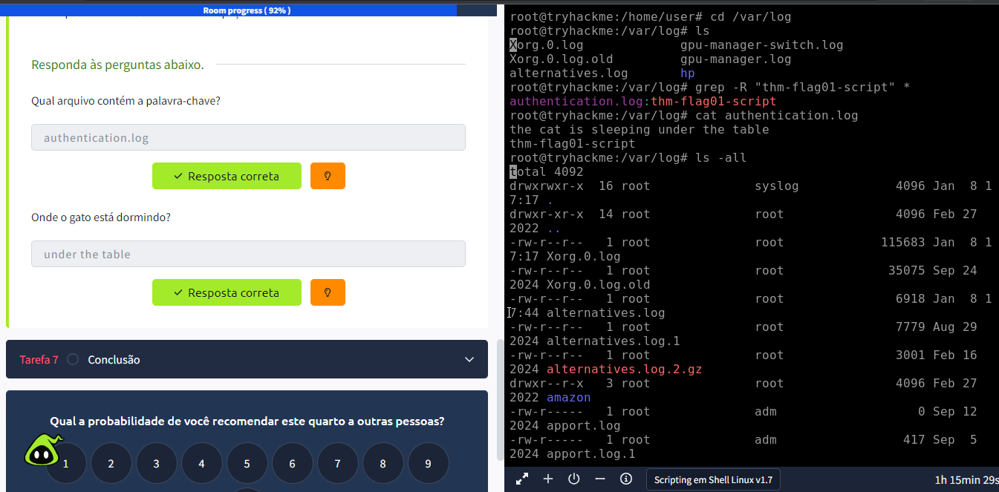

# Linux Scripting & Troubleshooting - TryHackMe

This repository documents a hands-on lab focused on Linux command line usage,
log analysis, script debugging and basic automation concepts.

The objective of this project is to demonstrate practical problem-solving
skills in a simulated investigation environment.

---

## 📸 Lab Screenshot

---

## 🧠 Topics Covered

- Linux privilege escalation using sudo
- Log file analysis with grep
- Searching for keywords inside system directories
- File inspection and investigation
- Debugging shell scripts
- Basic automation concepts
- Command-line efficiency and troubleshooting

---

## 📂 Repository Structure

